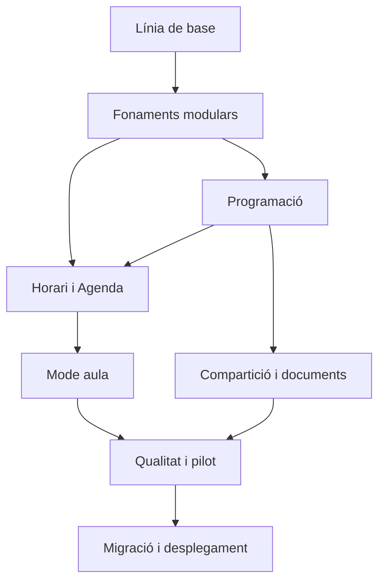

# Pla d'acció — Integració de Programació, Agenda i Mode aula a AvaluaPro

Data de creació: 18 de setembre de 2026

Document funcional de referència: `docs/ESPECIFICACIO-FUNCIONAL-ACORDADA.md`

## 1. Objectiu del pla

Aquest pla converteix l'especificació acordada en un ordre de treball executable. La prioritat és formar unes bases segures abans d'afegir detalls visuals o automatismes, i tancar cada bloc complet abans d'obrir el següent.

La construcció es divideix en **20 iteracions agrupades en 8 blocs**. Una iteració no és només una llista de canvis: ha d'acabar amb un resultat demostrable, provat, documentat i recuperable.

## 2. Principis de treball

### 2.1 Un bloc actiu

- Només hi haurà un bloc funcional principal en desenvolupament.
- No es començarà un bloc nou mentre l'anterior tingui errors crítics, migracions incompletes o regles de seguretat pendents.
- Les idees noves es registraran al document funcional o a una llista posterior; no interrompran automàticament el bloc actiu.

### 2.2 Fonaments abans que aparença final

L'ordre serà:

1. protegir i mesurar l'AvaluaPro actual;
2. separar els nous mòduls i la càrrega de dades;
3. definir model, permisos i sincronització;
4. construir Programació;
5. construir Agenda;
6. construir Mode aula;
7. afegir compartició, documents i migració;
8. validar amb un pilot real i desplegar progressivament.

El disseny visual acordat guiarà les pantalles des del principi, però el poliment final arribarà quan els fluxos i les dades ja siguin estables.

### 2.3 Talls verticals complets

Cada iteració ha d'unir, quan correspongui:

- interfície;
- dades locals;
- sincronització Firebase;
- regles de seguretat;
- tractament d'errors;
- proves;
- documentació.

No es considerarà acabada una pantalla que només funcioni amb dades simulades si la iteració promet persistència real.

### 2.4 Cap dada real en risc

- Les dades existents d'AvaluaPro es preservaran.
- Els canvis nous començaran darrere d'una funcionalitat desactivable o en un entorn de prova.
- Qualsevol migració tindrà previsualització i reversió.
- Les aplicacions antigues continuaran disponibles durant el pilot.
- No es faran substitucions silencioses entre dispositius o versions.

## 3. Flux ideal d'una iteració

Cada iteració seguirà aquest ordre:

1. **Objectiu concret:** definir una única capacitat observable.
2. **Revisió prèvia:** comprovar codi actual, dades afectades, regles i dependències.
3. **Contracte:** escriure o actualitzar el model de dades, permisos i comportament esperat.
4. **Implementació mínima completa:** construir el recorregut sencer sense afegir extres.
5. **Proves focalitzades:** validar regles de negoci, sincronització i permisos rellevants.
6. **Prova visual real:** comprovar la interfície en ordinador i, quan correspongui, iPad.
7. **Prova amb dades reals o representatives:** verificar el recorregut que utilitzarà el docent.
8. **Documentació:** actualitzar decisions, esquemes i comentaris de codi necessaris.
9. **Tancament:** revisar diferències, fer commit selectiu i deixar el repositori en un estat reproduïble.
10. **Punt de control:** registrar què funciona, què queda fora i quin bloc pot començar després.

## 4. Definició de «fet»

Una iteració només es tanca quan compleix tots els punts aplicables:

- El comportament coincideix amb l'especificació.
- Les dades sobreviuen una recàrrega.
- Els canvis pendents sobreviuen una pèrdua temporal de connexió.
- Les regles de Firebase permeten només els accessos acordats.
- Hi ha proves d'accés permès i denegat quan s'afegeixen permisos.
- No es carrega una col·lecció completa si només cal un subconjunt.
- Els errors tenen un missatge entenedor i no fan perdre dades.
- El flux principal s'ha comprovat visualment en una pàgina real.
- Ordinador i iPad s'han validat quan la pantalla és d'ús a l'aula.
- Els canvis tenen comentaris o documentació quan la intenció no és evident.
- El codi no conté duplicacions evitables ni dependències circulars noves.
- El repositori queda sense canvis accidentals ni fitxers temporals inclosos.
- El canvi queda registrat en un commit identificable.

## 5. Estàndard de documentació del codi

L'objectiu no és omplir el projecte de comentaris, sinó explicar allò que una persona no pot deduir fàcilment llegint el codi.

### 5.1 Què s'ha de documentar

- Propòsit dels mòduls de domini.
- Regles de negoci importants, com la diferència entre UP base i aplicació per grup.
- Invariants, com ara que una absència justificada no compta com a tasca no feta.
- Efectes laterals: què es desa, què se sincronitza i què es reprograma.
- Estratègies de conflicte entre dispositius.
- Decisions de privacitat i camps que mai no es comparteixen amb direcció.
- Transformacions de migració i correspondència entre camps antics i nous.
- Funcions públiques o serveis que reben o retornen estructures complexes.

### 5.2 Formats

- **JSDoc** per a serveis, funcions públiques i estructures complexes.
- **Comentaris curts** al costat d'una regla no evident.
- **Documents de decisió** a `docs/decisions/` per a decisions d'arquitectura que afecten diversos mòduls.
- **Esquemes de dades** a `docs/data-model/` amb exemples sense dades personals.
- **Proves amb noms descriptius** que expliquin la regla que protegeixen.

### 5.3 Què s'ha d'evitar

- Comentaris que només repeteixen la línia següent.
- Descripcions obsoletes copiades entre fitxers.
- Noms genèrics com `data`, `item` o `handleThing` quan el domini permet un nom precís.
- Regles de negoci amagades dins de components visuals grans.
- Un únic magatzem global que obligui a carregar tots els mòduls.

## 6. Arquitectura que s'ha de protegir

Abans de construir pantalles completes, el codi quedarà separat en dominis:

```text
src/
├── app/                 navegació, sessió i composició general
├── features/
│   ├── planning/        UT, UP, fases, activitats i versions
│   ├── agenda/          horari, calendari i assignacions
│   ├── classroom/       Mode aula i resultat real
│   ├── tracking/        tasques, constància i comportament existent
│   └── sharing/         permisos, direcció i coedició
├── data/
│   ├── local/           IndexedDB i cua local
│   ├── cloud/           Firestore i consultes selectives
│   └── migrations/      formats i transformacions versionades
├── domain/              regles de negoci sense interfície
└── components/          peces visuals compartides
```

L'estructura exacta es podrà ajustar després de revisar el repositori, però s'han de mantenir aquestes fronteres conceptuals.

## 7. Blocs i iteracions

### 7.1 Control d'estat

Cada iteració utilitzarà un únic estat: `PENDENT`, `EN CURS`, `BLOQUEJADA` o `COMPLETA`.

- Només una iteració pot estar `EN CURS`.
- Una iteració només passa a `COMPLETA` quan compleix el seu criteri de tancament i la definició de «fet».
- Un bloc només es tanca quan totes les seves iteracions estan `COMPLETES` i no té riscos crítics ajornats.
- Si una iteració queda `BLOQUEJADA`, se'n registrarà la causa concreta i la condició necessària per reprendre-la.

Estat actual:

- iteració 1: `COMPLETA` el 18 de setembre de 2026;
- iteració 2: `COMPLETA` el 18 de setembre de 2026;
- iteració 3: `COMPLETA` el 18 de setembre de 2026;
- iteració 4: `COMPLETA` el 18 de setembre de 2026;
- iteració 5: `COMPLETA` el 18 de setembre de 2026;
- iteració 6: `COMPLETA` el 19 de setembre de 2026;
- iteració 7: `COMPLETA` el 19 de setembre de 2026;
- iteració 8: `COMPLETA` el 19 de setembre de 2026;
- iteració 9: `COMPLETA` el 19 de setembre de 2026;
- iteració 10: `COMPLETA` el 19 de setembre de 2026;
- iteració 11: `COMPLETA` el 19 de setembre de 2026;
- iteració 12: `COMPLETA` el 19 de setembre de 2026;
- iteració 13: `COMPLETA` el 19 de setembre de 2026;
- iteració 14: `EN CURS` des del 19 de setembre de 2026;
- iteracions 15-20: `PENDENTS`.

La línia de base tècnica i els riscos oberts es registren al repositori d'AvaluaPro, a `docs/dev/LINIA-BASE-PLANIFICACIO.md`.

### 7.2 Resum dels blocs

| Bloc | Iteracions | Resultat tancat |
|---|---:|---|
| 0. Línia de base | 1 | AvaluaPro actual verificat i protegit |
| 1. Fonaments modulars | 2-5 | Mòduls, model, permisos i sincronització preparats |
| 2. Programació | 6-9 | UP completa, versionada i editable |
| 3. Horari i Agenda | 10-12 | Programació calendaritzada i reajustable per grup |
| 4. Mode aula | 13-15 | Classe operativa connectada amb AvaluaPro |
| 5. Compartició i documents | 16-17 | Lectura, coedició, Word i importacions segures |
| 6. Qualitat i pilot | 18-19 | Producte validat amb una UP real |
| 7. Migració i desplegament | 20 | Dades migrades i activació controlada |

## 8. Detall de les 20 iteracions

### Bloc 0 — Línia de base

#### Iteració 1 — Verificació i xarxa de seguretat

Objectiu: demostrar que l'AvaluaPro actual desa, recupera i protegeix correctament les dades abans d'afegir nous mòduls.

Lliurables:

- prova autenticada de desament i recàrrega en una pàgina nova;
- comprovació ordinador/iPad del flux de sincronització;
- còpia exportable de les dades actuals;
- inventari de col·leccions, regles, índexs i càrrega inicial;
- mesures inicials de lectures, escriptures, mida i temps de càrrega;
- registre dels riscos i dades que no es poden perdre.

Criteri de tancament: la sincronització actual queda demostrada i hi ha una còpia recuperable.

Estat: `COMPLETA`. La línia de base inclou còpia validada, recuperació autenticada, sincronització de les 8 respostes sociomètriques, auditoria sense bloquejos i verificació en una pestanya nova.

### Bloc 1 — Fonaments modulars

#### Iteració 2 — Carcassa, navegació i funcionalitats desactivables

Objectiu: preparar Agenda i Programació dins d'AvaluaPro sense carregar encara dades noves.

Lliurables:

- fronteres de mòdul;
- navegació acordada;
- càrrega diferida del codi de cada mòdul;
- funcionalitats activables només per a proves;
- primers documents de decisió.

Criteri de tancament: AvaluaPro continua funcionant igual i els nous espais es poden activar de manera controlada.

Estat: `COMPLETA`. Agenda i Programació tenen carcasses separades i desactivades per defecte; les pantalles grans es carreguen de manera diferida i el paquet inicial s'ha reduït un 40,9%.

#### Iteració 3 — Model de domini i identificadors

Objectiu: definir entitats, relacions i versions abans de construir formularis.

Lliurables:

- curs acadèmic, UT, UP, fase, activitat, element de sessió, horari, esdeveniment, resultat i permisos;
- identificadors estables;
- esquemes versionats;
- diferència formal entre UP base i aplicació per grup;
- exemples documentats.

Criteri de tancament: les regles principals es poden provar sense interfície.

Estat: `COMPLETA`. S'han definit 15 entitats amb identificadors estables i esquemes versionats, la separació entre UP base i aplicació per grup, els tres abasts de canvi, els horaris versionats, el pressupost de temps i els permisos sense escalada implícita. Les 15 proves de domini, el lint, la construcció i tota la suite de seguretat són correctes.

#### Iteració 4 — Firestore, regles i consultes selectives

Objectiu: crear la persistència segura sense repetir la càrrega global actual.

Lliurables:

- col·leccions i índexs;
- accés per propietari, lector, coeditor i grup;
- notes privades separades;
- consultes per UP, grup i interval temporal;
- proves d'autorització i denegació.

Criteri de tancament: cap usuari pot llegir o modificar dades fora del seu permís.

Estat: `COMPLETA`. Les dades privades del curs i calendari, les UP compartibles, les aplicacions per grup, les sessions, els resultats i les notes privades tenen rutes separades, consultes limitades, 12 índexs i regles publicades. Les 76 proves de regles són correctes i la versió publicada conserva l'accés als cinc grups reals.

#### Iteració 5 — Local-first, offline i conflictes

Objectiu: establir la sincronització abans que els nous mòduls generin dades reals.

Lliurables:

- IndexedDB modular;
- cua persistent;
- càrrega sota demanda;
- conflictes entre ordinador i iPad;
- estat Desat/Desant/Pendent/Sense connexió/Cal revisar/Error;
- eliminació de la còpia local en tancar sessió.

Criteri de tancament: un canvi offline es recupera i se sincronitza sense substituir una edició posterior.

Estat: `COMPLETA`. Planificació té IndexedDB pròpia, cua persistent, càrrega per abast, comparació transaccional amb Firestore i resolució explícita de conflictes. Les 15 proves demostren que una edició offline sobreviu, una confirmació antiga no retira la nova, una modificació de l'iPad no és substituïda silenciosament i una fallada de lectura remota conserva la còpia local.

### Bloc 2 — Programació

#### Iteració 6 — Curs acadèmic, UT i estructura de la UP

Objectiu: crear i navegar l'esquelet complet de programació.

Lliurables:

- cursos acadèmics;
- dates manuals de les UT;
- creació, edició, arxiu i consulta de UP;
- editor de tres zones;
- fases i subfases flexibles.

Criteri de tancament: una UP buida es pot crear, desar, recarregar i arxivar.

Estat: `COMPLETA`. La interfície publicada permet crear el curs, definir dates manuals de les UT i gestionar UP, fases i subfases amb desament local-first. Una prova integrada crea i recarrega una UP buida amb les tres fases inicials, l'arxiva i confirma que una edició antiga no pot substituir-ne la versió actual. La pantalla s'ha comprovat amb el compte autenticat en ordinador i mida iPad sense crear dades fictícies al compte real.

#### Iteració 7 — Activitats, temps i cronologia

Objectiu: construir els elements centrals de la seqüència.

Lliurables:

- activitats, indicacions i transicions;
- reordenació per nansa;
- temps previst;
- pressupost 55/85/115;
- colors de capacitat;
- materials externs i agrupaments.

Criteri de tancament: una seqüència completa es pot ordenar i validar sense Agenda.

Estat: `COMPLETA`. La seqüència publicada permet crear, editar, eliminar i ordenar activitats, indicacions i transicions dins d'una fase o entre fases, tant amb ratolí com amb interacció tàctil. Calcula els minuts per fase i per UP, aplica els marges de 55/85/115 minuts, avisa de la sobrecàrrega i conserva agrupaments, espais i materials externs. El flux s'ha validat amb 17 proves de domini, 15 de sincronització local i 79 de regles, sense crear dades fictícies al compte real.

#### Iteració 8 — Currículum, avaluació i diversitat

Estat: `COMPLETA`. La UP publicada ja incorpora competències, aprenentatges esperats, criteris, indicadors, recursos i sabers amb una fotografia textual llegible i vincles opcionals a AvaluaPro. Les activitats poden associar indicadors i aplicar voluntàriament mesures de la biblioteca a alumnat seleccionat. El model descarta diagnòstics i notes personals abans de persistir, i les 80 proves de regles confirmen que direcció rep la mesura pedagògica sense aquests camps privats.

Objectiu: completar els camps oficials de la UP.

Lliurables:

- competències, aprenentatges, criteris i indicadors;
- recursos específics i transversals;
- biblioteca d'adaptacions connectada amb AvaluaPro;
- selecció voluntària de mesures i alumnes;
- protecció de diagnòstics i notes personals.

Criteri de tancament: la UP conté tot el que direcció espera veure sense exposar informació privada.

#### Iteració 9 — Versions, històric i millora anual

Estat: `COMPLETA`. La duplicació anual crea una UP, fases, subfases i activitats amb identificadors nous, conserva la procedència i no hereta convidats. L'històric només es carrega quan s'obre i permet cercar activitats per número, títol o descripció i copiar-les sense alterar l'origen. El model ja compara temps previst i real per grup, genera propostes revisables i només aplica les que el docent accepta individualment o conjuntament. Les 81 proves de regles inclouen una còpia completa desada i confirmen que la versió anterior queda intacta.

Objectiu: permetre evolució entre cursos sense perdre el passat.

Lliurables:

- duplicació anual;
- cerca i còpia d'activitats antigues;
- procedència de la còpia;
- propostes de millora;
- acceptació individual o conjunta;
- comparació prevista-real preparada per rebre dades d'Agenda.

Criteri de tancament: una versió nova es pot crear i modificar sense alterar l'anterior.

### Bloc 3 — Horari i Agenda

#### Iteració 10 — Horari versionat i calendari manual

Estat: `COMPLETA`. Agenda té una graella arrossegable amb sessions de 60, 90 i 120 minuts, mig grup i aula opcional; versions amb vigència i còpia segura; excepcions manuals per grup; persistència local-first i privacitat comprovada. Canviar l'horari conserva la versió anterior i no modifica les sessions ja creades.

Objectiu: construir la base temporal.

Lliurables:

- graella arrossegable;
- franges de 60, 90 i 120 minuts;
- mig grup;
- aula opcional;
- vigència per dates;
- festius i dies no lectius manuals;
- classes extraordinàries.

Criteri de tancament: canviar l'horari no modifica les sessions passades.

#### Iteració 11 — Assignació progressiva i distribució automàtica

Estat: `COMPLETA`. Agenda connecta una UP amb un grup mitjançant una proposta progressiva o completa, reutilitza els minuts lliures de sessions ja previstes, divideix activitats llargues, manté indicacions sense temps, salta excepcions del calendari i només escriu després de la confirmació. Cada fragment conserva el vincle amb l'activitat original i les activitats ja assignades no es dupliquen.

Objectiu: connectar la UP ideal amb les dates d'un grup.

Lliurables:

- afegir activitats progressivament;
- proposta automàtica completa;
- divisió d'activitats llargues;
- previsualització;
- salt de festius;
- confirmació abans d'escriure.

Criteri de tancament: una UP es pot calendaritzar sense duplicar ni perdre l'activitat original.

#### Iteració 12 — Avui, setmana, cronologia i reajustaments

Estat: `COMPLETA`. Agenda mostra la sessió actual o pròxima, recordatoris d'avui i tres dies, setmana i cronologia per grup. Les cancel·lacions retornen només els minuts afectats a la cua pendent; les continuacions es distribueixen amb previsualització; els canvis d'activitat ofereixen els tres abasts acordats; i les classes extraordinàries poden avançar la UP.

Objectiu: completar el treball ordinari d'Agenda.

Lliurables:

- Avui amb detall de la pròxima sessió;
- recordatoris d'avui i tres dies;
- vista setmanal;
- cronologia per grup;
- cancel·lació i continuacions;
- classes extraordinàries que avancen la UP;
- tres opcions per propagar canvis entre grup i UP base.

Criteri de tancament: el docent pot replanificar una setmana completa amb previsualització dels efectes.

### Bloc 4 — Mode aula

#### Iteració 13 — Panell de classe, assistència i temporitzador

Estat: `COMPLETA`. Agenda avisa cinc minuts abans i obre voluntàriament una pantalla de classe completa. La cronologia destaca l'activitat actual, admet indicacions sense temps, cronòmetre silenciós amb excés positiu i correcció retrospectiva, continuacions, assistència de grup o mig grup, i tancament local-first amb resum. Les absències actualitzen el registre existent d'AvaluaPro amb la durada real de la sessió.

Objectiu: fer usable la sessió real a l'aula.

Lliurables:

- avís cinc minuts abans;
- Mode aula a pantalla completa;
- cronologia elegant sense targetes;
- activitat actual destacada;
- compte enrere silenciós i excés positiu;
- correcció retroactiva;
- assistència completa i mig grup.

Criteri de tancament: una classe es pot iniciar, temporitzar i tancar sense sortir de Mode aula.

#### Iteració 14 — Tasques, constància, comportament i notes

Estat: `EN CURS`.

Objectiu: connectar la classe amb els registres existents d'AvaluaPro.

Lliurables:

- seguiment de tasques filtrat a la sessió;
- evidència final o parcial;
- categories actuals de comportament com a botons;
- selecció múltiple;
- reflexió pedagògica;
- nota privada;
- botó Revisar i temps real.

Criteri de tancament: els registres actualitzen les estadístiques existents sense duplicar sistemes.

#### Iteració 15 — Absències, recuperació i preparació

Objectiu: completar els casos reals de la sessió.

Lliurables:

- absència completa;
- sortida a mitja sessió;
- selecció d'activitats perdudes;
- tasca justificada pendent;
- recordatori de recuperació;
- text de correu editable i copiable;
- materials per preparar, imprimir, comprar o reservar;
- recordatori d'adaptacions a Mode aula.

Criteri de tancament: un alumne absent pot recuperar una activitat sense rebre un negatiu de constància incorrecte.

### Bloc 5 — Compartició i documents

#### Iteració 16 — Direcció i coedició

Objectiu: compartir sense exposar dades personals.

Lliurables:

- invitació per correu exacte;
- direcció amb lectura de la programació concreta;
- coeditor autoritzat amb edició de la UP;
- Agenda compartida només amb accés al grup;
- vista interactiva;
- comprovacions de revocació i permisos.

Criteri de tancament: direcció veu tot l'acordat i no pot llegir notes privades ni incidències individuals.

#### Iteració 17 — Vista documental, Word i importacions

Objectiu: unir el treball digital amb els formats del centre.

Lliurables:

- vista documental moderna;
- Word editable;
- importació de taules Excel/Numbers;
- primera importació Word validada;
- JSON versionat;
- espais preparats per a les imatges pedagògiques originals.

Criteri de tancament: una UP es pot consultar i obtenir en un format editable amb tots els camps oficials.

### Bloc 6 — Qualitat i pilot

#### Iteració 18 — Qualitat visual, accessibilitat i rendiment

Objectiu: polir el producte complet abans d'utilitzar-lo amb dades reals.

Lliurables:

- revisió ordinador/iPad;
- estats buits, càrrega, offline i error;
- teclat, focus i etiquetes;
- contrast i ús no exclusiu del color;
- mida de càrrega i consultes;
- eliminació de duplicacions i de codi provisional.

Criteri de tancament: els recorreguts principals es poden completar sense bloquejos ni informació ambigua.

#### Iteració 19 — Pilot d'una UP i un grup

Objectiu: validar comportament real durant dues o tres setmanes.

Lliurables:

- grup i UP seleccionats;
- horari real;
- ús en ordinador i iPad;
- registre d'incidències;
- comprovació de costos i sincronització;
- correccions del pilot;
- decisió formal de continuar o repetir.

Criteri de tancament: no hi ha pèrdua de dades i el docent pot treballar amb menys fricció que amb les aplicacions antigues.

### Bloc 7 — Migració i desplegament

#### Iteració 20 — Migració completa i activació progressiva

Objectiu: incorporar el llegat i obrir els mòduls de manera controlada.

Lliurables:

- convertidor Agenda + Programador → JSON nou;
- previsualització i duplicats;
- importació reversible;
- validació de recomptes i mostres;
- còpia prèvia;
- activació per usuaris o grups;
- manteniment temporal del llegat en consulta.

Criteri de tancament: dades antigues i noves coincideixen en recomptes, ordre, temps, materials i mostres revisades.

## 9. Dependències entre blocs



No es poden invertir les dependències principals: Mode aula necessita Agenda, i Agenda necessita una UP i un model temporal estables.

## 10. Punts de control amb el docent

No cal informació nova per començar les iteracions 1-5. El treball pot avançar amb el repositori, el Firebase de proves i les decisions ja recollides.

Es necessitarà intervenció del docent en aquests punts:

| Moment | Informació necessària |
|---|---|
| Abans de la iteració 8 | Confirmar exemples reals de mesures i el comportament desitjat de la biblioteca actual |
| Durant la iteració 13 | Validar visualment Mode aula en ordinador i iPad |
| Abans de la iteració 17 | Facilitar les imatges pedagògiques originals i un Word representatiu addicional si hi ha variants |
| Abans de la iteració 19 | Escollir el grup i la UP del pilot |
| Abans de la iteració 20 | Exportar les còpies definitives de l'Agenda i el Programador antics |

## 11. Registre de cada iteració

En tancar una iteració s'afegirà una nota breu amb aquest format:

```markdown
## Iteració N — Títol

- Objectiu:
- Comportament lliurat:
- Dades o regles modificades:
- Proves superades:
- Verificació visual:
- Riscos o limitacions:
- Decisions noves:
- Commit:
```

Aquest registre permetrà entendre en el futur per què existeix cada peça i quin canvi la va introduir.

## 12. Canvis d'abast

Si apareix una idea nova durant la implementació:

1. es descriu al document funcional;
2. es comprova si modifica dades, permisos o dependències;
3. s'assigna a una iteració futura o substitueix explícitament una decisió anterior;
4. no s'incorpora de manera oportunista dins d'una iteració que ja té un criteri de tancament.

Aquest mecanisme evita blocs eterns i manté el projecte revisable.
